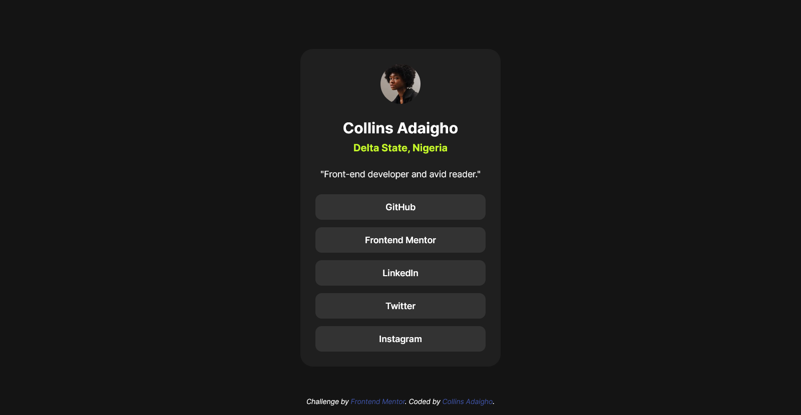

# Frontend Mentor - Social links profile solution

This is a solution to the [Social links profile challenge on Frontend Mentor](https://www.frontendmentor.io/challenges/social-links-profile-UG32l9m6dQ). Frontend Mentor challenges help you improve your coding skills by building realistic projects. 

## Table of contents
- [Frontend Mentor - Social links profile solution](#frontend-mentor---social-links-profile-solution)
  - [Table of contents](#table-of-contents)
  - [Overview](#overview)
    - [The challenge](#the-challenge)
    - [Screenshot](#screenshot)
    - [Links](#links)
  - [My process](#my-process)
    - [Built with](#built-with)
    - [What I learned](#what-i-learned)
    - [Continued development](#continued-development)
  - [Author](#author)

## Overview

### The challenge

### Screenshot

### Links

- Solution URL: [Repository URL](https://github.com/Donsmatt/fm_social_link_profile)
- Live Site URL: [Social links profile live site](https://fm-social-link-profile-delta.vercel.app/)

## My process

### Built with

- Semantic HTML5 markup
- CSS custom properties
- CSS Variables
- Flexbox
- CSS Grid
- CSS variable fonts

### What I learned

Wasn't as exciting as when i had figma design files to work with. But i was able to scale through, somehow.

### Continued development

I would want to improve on my css code optimization and naming conventions.

## Author

- Frontend Mentor - [@Donsmatt](https://www.frontendmentor.io/profile/Donsmatt)
- Twitter - [@Donsmatt](https://x.com/CAdaigho)
- Github = [@Donsmatt](https://github.com/Donsmatt)
